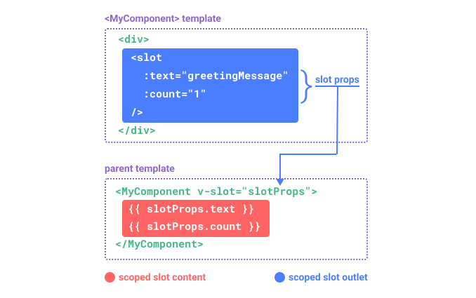

# 组件

## 注册

一个 Vue 组件需要被"注册"使得 Vue 在渲染模板时能找到其并实现。有两种方式来注册组件：全局注册和局部注册。

### 全局注册

可以使用 `app.component()` 方法, 让组件在当前 Vue 应用中全局可用。

```js
import { createApp } from "vue";

const app = createApp({});

app.component(
  // 注册的名字
  "MyComponent",
  // 组件的实现
  {
    /* ... */
  }
);
```

如果使用单文件组件, 可用注册被导入的 `.vue` 文件：

```js
import MyComponent from "./App.vue";

app.component("MyComponent", MyComponent);
```

`app.component()` 方法可以被链式调用：

```js
app
  .component("ComponentA", ComponentA)
  .component("ComponentB", ComponentB)
  .component("ComponentC", ComponentC);
```

### 局部注册

全局注册虽然方便, 但有以下几个问题：

1. 全局注册, 但并没有被使用的组件无法在生产打包时被自动移除(也叫 "tree-shaking")。如果全局注册了一个组件, 即使它并没有被实际使用, 它仍然会出现在打包后的 JS 文件中。
2. 全局注册在大型项目中使项目的依赖关系变得不那么明确。在父组件中使用了子组件时, 不太容易定位子组件的实现。和使用过多的全局变量一样, 这可能会影响应用长期的可维护性。

相比之下, 局部注册的组件需要在使用它的父组件中显示导入, 并且只能在父组件中使用。它的优点是使组件之间的依赖关系更加明确, 并且对 tree-shaking 更加友好。

在使用 `<script setup>` 的单文件组件中, 导入的组件可以直接在模板中使用, 无需注册：

```js
<script setup>
import ComponentA from './ComponentA.vue'
</script>

<template>
  <ComponentA />
</template>
```

如果没有使用 `<script setup>`，则需要使用 `components` 选项来显式注册：

```js
import ComponentA from "./ComponentA.js";

export default {
  components: {
    ComponentA,
  },
  setup() {
    // ...
  },
};
```

:::tip Note
推荐使用 PascalCase 作为组件名的注册格式 ❗
:::

## Props

### Props 声明

一个组件需要显式声明它所接受的 props, 这样 Vue 才能知道外部传入的哪些是 props, 哪些是透传 attribute。

在使用 `<script setup>` 的单文件组件中, props 可以使用 `defineProps()` 宏来声明：

```vue
<script setup>
const props = defineProps(["foo"]);

console.log(props.foo);
</script>
```

在没有使用 `<script setup>` 的组件中, prop 可以使用 `props` 选项来声明：

```js
export default {
  props: ["foo"],
  setup(props) {
    // setup() 接收 props 作为第一个参数
    console.log(props.foo);
  },
};
```

注意传递给 `defineProps()` 的参数和提供给 `props` 选项的值是相同的, 两种声明方式的背后其实使用的都是 prop 选项。

除了使用字符串数组来声明 prop 外, 还可以使用对象的形式：

```js
// 使用 <script setup>
defineProps({
  title: String,
  likes: Number,
});
```

```js
// 非 <script setup>
export default {
  props: {
    title: String,
    likes: Number,
  },
};
```

### 单向数据流

**所有的 props 都遵循着单向绑定原则**, props 因父组件的更新而变化, 自然地将新状态向下流往子组件, 而不会逆向传递。这避免了子组件意外修改父组件状态的情况, 不然应用的数据流将很容易变得混乱而难以理解。

**另外, 每次父组件更新后, 所有的子组件中的 props 都会被更新到最新值, 这意味着不应该在子组件中去更改一个 prop**。若这么做了, Vue 会在控制台上向你抛出警告：

```js
const props = defineProps(["foo"]);

// ❌ 警告！prop 是只读的！
props.foo = "bar";
```

导致想要更改一个 prop 的需求通常来源于以下两种场景“

1. **prop 被用于传入初始值；而子组件想在之后将其作为一个局部数据属性**。在这种情况下, 最好是新定义一个局部数据属性, 从 props 上获取初始值即可：

```js
const props = defineProps(["initialCounter"]);

// 计数器只是将 props.initialCounter 作为初始值
// 像下面这样做就使 prop 和后续更新无关了
const counter = ref(props.initialCounter);
```

2. **需要对传入的 prop 值做进一步的转换**。在这种情况下, 最好是基于该 prop 值定义一个计算属性：

```js
const props = defineProps(["size"]);

// 该 prop 变更时计算属性也会自动更新
const normalizedSize = computed(() => props.size.trim().toLowerCase());
```

### 更改对象 / 数组类型的 props

当对象或数组作为 props 被传入时, 虽然子组件无法更改 props 绑定, 但仍然可以更改对象或数组内部的值。这是因为 JavaScript 的对象和数组是按引用传递, 而对 Vue 来说, 禁止这样的改动虽然可能, 但有很大的性能损耗, 比较得不偿失。

这种更改的主要缺陷是它允许了子组件以某种不明显的方式影响父组件的状态, 可能会使数据流在将来变得更难以理解。在最佳实践中, 应该尽可能避免这样的更改, 除非父子组件在设计上本来就需要紧密耦合。在大多数场景下, 子组件应该抛出一个事件来通知父组件做出改变。

### Prop 校验

Vue 组件可以更细致地声明对传入的 props 校验要求。要声明对 props 的校验, 可以向 `defineProps()` 宏提供一个带有 props 校验选项的对象, 例如：

```js
defineProps({
  // 基础类型检查
  // （给出 `null` 和 `undefined` 值则会跳过任何类型检查）
  propA: Number,
  // 多种可能的类型
  propB: [String, Number],
  // 必传，且为 String 类型
  propC: {
    type: String,
    required: true,
  },
  // Number 类型的默认值
  propD: {
    type: Number,
    default: 100,
  },
  // 对象类型的默认值
  propE: {
    type: Object,
    // 对象或数组的默认值
    // 必须从一个工厂函数返回。
    // 该函数接收组件所接收到的原始 prop 作为参数。
    default(rawProps) {
      return { message: "hello" };
    },
  },
  // 自定义类型校验函数
  propF: {
    validator(value) {
      // The value must match one of these strings
      return ["success", "warning", "danger"].includes(value);
    },
  },
  // 函数类型的默认值
  propG: {
    type: Function,
    // 不像对象或数组的默认，这不是一个工厂函数。这会是一个用来作为默认值的函数
    default() {
      return "Default function";
    },
  },
});
```

:::tip Notes
`defineProps()` 宏中的参数不可以访问 `<script setup>` 中定义的其他变量, 因为在编译时整个表达式都会被移到外部的函数中。
:::

一些补充细节：

- 所有 prop 默认都是可选的, 除非声明了 `required: true`
- 除 `Boolean` 外的未传递的可选 prop 将会有一个默认值 `undefined`
- `Boolean` 类型的未传递 prop 将被转换为 `false`。应该为它设置一个 `default` 值来确保行为符合预期。
- 如果声明了 `default` 值, 那么在 prop 值被解析为 `undefined` 时, 无论 prop 是未被传递还是显式指明的 `undefined`, 都会更改为 `default` 值。

当 prop 的检验失败后, Vue 会抛出一个控制台警告(在开发模式下)。

#### 运行时类型检查

校验选项中的 `type` 可以是下列这些原生构造函数：

- `String`
- `Number`
- `Boolean`
- `Array`
- `Object`
- `Date`
- `Function`
- `Symbol`

另外, `type` 也可以是自定义的类或构造函数, Vue 将会通过 `instanceof` 来检查类型是否匹配。例如下面这个类：

```js
class Person {
  constructor(firstName, lastName) {
    this.firstName = firstName;
    this.lastName = lastName;
  }
}
```

也可以将其作为一个 prop 的类型：

```js
defineProps({
  author: Person,
});
```

Vue 会通过 `instanceof Person` 来校验 `author` prop 的值是否是 `Person` 类的一个实例。

### Boolean 类型转换

为了更贴近原生 boolean attributes 的行为, 声明为 `Boolean` 类型的 props 有特别的类型转换规则。以带有如下声明的 `<MyComponent>` 组件为例：

```js
defineProps({
  disabled: Boolean,
});
```

该组件可以被这样使用：

```html
<!-- 等同于传入 :disabled="true" -->
<MyComponent disabled />

<!-- 等同于传入 :disabled="false" -->
<MyComponent />
```

当一个 prop 被声明为允许多种类型时, 例如：

```js
defineProps({
  disabled: [Boolean, Number],
});
```

无论声明类型的顺序如何，Boolean 类型的特殊转换规则都会被应用。

## 组件事件

### 触发与监听事件

在组件的模板表达式中, 可以直接使用 `$emit` 方法触发自定义事件(例如：在 `v-on` 的处理函数中)：

```html
<!-- MyComponent -->
<button @click="$emit('someEvent')">click me</button>
```

父组件可以通过 `v-on`(缩写为 `@`) 来监听事件：

```html
<MyComponent @some-event="callback" />
```

同样, 组件的事件监听器也支持 `.once` 修饰符：

```html
<MyComponent @some-event.once="callback" />
```

像组件与 prop 一样, 事件的名字也提供了自动的格式转换。

:::tip Note
和原生 DOM 事件不一样，组件触发的事件没有冒泡机制。你只能监听直接子组件触发的事件。平级组件或是跨越多层嵌套的组件间通信，应使用一个外部的事件总线，或是使用一个全局状态管理方案。
:::

### 声明触发的事件

组件要触发的事件可以显式地通过 `defineEmits()` 宏来声明：

```vue
<script setup>
defineEmits(["inFocus", "submit"]);
</script>
```

**在 `<template>` 中使用的 `$emit` 方法不能在组件的 `<script setup>` 部分中使用，但 `defineEmits()` 会返回一个相同作用的函数供我们使用**：

```vue
<script setup>
const emit = defineEmits(["inFocus", "submit"]);

function buttonClick() {
  emit("submit");
}
</script>
```

**`defineEmits()` 宏不能在子函数中使用**。如上所示，它必须直接放置在 `<script setup>` 的顶级作用域下。

如果你显式地使用了 `setup` 函数而不是 `<script setup>`，则事件需要通过 `emits` 选项来定义，emit 函数也被暴露在 `setup()` 的上下文对象上：

```js
export default {
  emits: ["inFocus", "submit"],
  setup(props, ctx) {
    ctx.emit("submit");
  },
};
```

与 `setup()` 上下文对象中的其他属性一样，`emit` 可以安全地被解构：

```js
export default {
  emits: ["inFocus", "submit"],
  setup(props, { emit }) {
    emit("submit");
  },
};
```

这个 `emits` 选项还支持对象语法，它允许我们对触发事件的参数进行验证：

```vue
<script setup>
const emit = defineEmits({
  submit(payload) {
    // 通过返回值为 `true` 还是为 `false` 来判断
    // 验证是否通过
  },
});
</script>
```

尽管事件声明是可选的，我们还是推荐你完整地声明所有要触发的事件，以此在代码中作为文档记录组件的用法。同时，事件声明能让 Vue 更好地将事件和透传 `attribute` 作出区分，从而避免一些由第三方代码触发的自定义 DOM 事件所导致的边界情况。

:::tip Note
所有传入 `$emit()` 的额外参数都会被直接传向监听器。举例来说, `$emit('foo', 1, 2, 3)` 触发后, 监听函数将会收到这三个参数值。
:::

### 事件校验

和对 props 添加类型校验的方式类似，所有触发的事件也可以使用对象形式来描述。

要为事件添加校验，那么事件可以被赋值为一个函数，接受的参数就是抛出事件时传入 `emit` 的内容，返回一个布尔值来表明事件是否合法。

```vue
<script setup>
const emit = defineEmits({
  // 没有校验
  click: null,

  // 校验 submit 事件
  submit: ({ email, password }) => {
    if (email && password) {
      return true;
    } else {
      console.warn("Invalid submit event payload!");
      return false;
    }
  },
});

function submitForm(email, password) {
  emit("submit", { email, password });
}
</script>
```

### 配合 `v-model` 使用

自定义事件可以用于开发支持 v-model 的自定义表单组件。回忆一下 v-model 的用法：

```html
<input v-model="searchText" />
```

上面的代码其实等价于下面这段（编译器会对 v-model 进行展开）：

```html
<input :value="searchText" @input="searchText = $event.target.value" />
```

而当使用在一个组件上时，v-model 会被展开为如下的形式：

```html
<CustomInput
  :modelValue="searchText"
  @update:modelValue="(newValue) => (searchText = newValue)"
/>
```

要让这个例子实际工作起来，`<CustomInput>` 组件内部需要做两件事：

- 将内部原生 input 元素的 value attribute 绑定到 modelValue prop
- 输入新的值时在 input 元素上触发 update:modelValue 事件

```vue
<!-- CustomInput.vue -->
<script setup>
defineProps(["modelValue"]);
defineEmits(["update:modelValue"]);
</script>

<template>
  <input
    :value="modelValue"
    @input="$emit('update:modelValue', $event.target.value)"
  />
</template>
```

现在 `v-model` 也可以在这个组件上正常工作了：

```html
<CustomInput v-model="searchText" />
```

另一种在组件内实现 `v-model` 的方式是使用一个可写的，同时具有 `getter` 和 `setter` 的计算属性。`get` 方法需返回 `modelValue` prop，而 `set` 方法需触发相应的事件：

```vue
<!-- CustomInput.vue -->
<script setup>
import { computed } from "vue";

const props = defineProps(["modelValue"]);
const emit = defineEmits(["update:modelValue"]);

const value = computed({
  get() {
    return props.modelValue;
  },
  set(value) {
    emit("update:modelValue", value);
  },
});
</script>

<template>
  <input v-model="value" />
</template>
```

#### `v-model` 参数

默认情况下，`v-model` 在组件上都是使用 `modelValue` 作为 prop，并以 `update:modelValue` 作为对应的事件。可以通过给 `v-model` 指定一个参数来更改这些名字：

```html
<MyComponent v-model:title="bookTitle" />
```

在这个例子中，子组件应声明一个 `title` prop，并通过触发 `update:title` 事件更新父组件值：

```vue
<!-- MyComponent.vue -->
<script setup>
defineProps(["title"]);
defineEmits(["update:title"]);
</script>

<template>
  <input
    type="text"
    :value="title"
    @input="$emit('update:title', $event.target.value)"
  />
</template>
```

#### 多个 `v-model` 绑定

可以在一个组件上创建多个 `v-model` 双向绑定，每一个 `v-model` 都会同步不同的 prop：

```html
<UserName v-model:first-name="first" v-model:last-name="last" />
```

```vue
<script setup>
defineProps({
  firstName: String,
  lastName: String,
});

defineEmits(["update:firstName", "update:lastName"]);
</script>

<template>
  <input
    type="text"
    :value="firstName"
    @input="$emit('update:firstName', $event.target.value)"
  />
  <input
    type="text"
    :value="lastName"
    @input="$emit('update:lastName', $event.target.value)"
  />
</template>
```

### 处理 `v-model` 修饰符

在某些场景下，你可能想要一个自定义组件的 `v-model` 支持自定义的修饰符。

创建一个自定义的修饰符 `capitalize`，它会自动将 `v-model` 绑定输入的字符串值第一个字母转为大写：

```html
<MyComponent v-model.capitalize="myText" />
```

组件的 `v-model` 上所添加的修饰符，可以通过 `modelModifiers` prop 在组件内访问到。在下面的组件中，声明了 `modelModifiers` 这个 prop，它的默认值是一个空对象：

```vue
<script setup>
const props = defineProps({
  modelValue: String,
  modelModifiers: { default: () => ({}) },
});

defineEmits(["update:modelValue"]);

console.log(props.modelModifiers); // { capitalize: true }
</script>

<template>
  <input
    type="text"
    :value="modelValue"
    @input="$emit('update:modelValue', $event.target.value)"
  />
</template>
```

注意这里组件的 `modelModifiers` prop 包含了 `capitalize` 且其值为 true，因为它在模板中的 `v-model` 绑定上被使用了。

有了 `modelModifiers` 这个 prop，我们就可以在原生事件侦听函数中检查它的值，然后决定触发的自定义事件中要向父组件传递什么值。在下面的代码里，我们就是在每次 `<input>` 元素触发 `input` 事件时将值的首字母大写：

```vue
<script setup>
const props = defineProps({
  modelValue: String,
  modelModifiers: { default: () => ({}) },
});

const emit = defineEmits(["update:modelValue"]);

function emitValue(e) {
  let value = e.target.value;
  if (props.modelModifiers.capitalize) {
    value = value.charAt(0).toUpperCase() + value.slice(1);
  }
  emit("update:modelValue", value);
}
</script>

<template>
  <input type="text" :value="modelValue" @input="emitValue" />
</template>
```

**对于又有参数又有修饰符的 `v-model` 绑定，生成的 prop 名将是 arg + "Modifiers"**。举例来说：

```html
<MyComponent v-model:title.capitalize="myText"></MyComponent>
```

相应的声明应该是：

```js
const props = defineProps(['title', 'titleModifiers'])
defineEmits(['update:title']) console.log(props.titleModifiers) // { capitalize:
true }
```

## 透传 Attributes

“透传 attribute”是传递给组件的 attribute 或者 `v-on` 事件监听器，但并没有显式地声明在所接收组件的 props 或 emits 上。最常见的例子就是 `class`、`style` 和 `id`。

当一个组件以单个元素为根作渲染时，透传的 attribute 会自动添加到根元素的 attribute 中。举个例子，下面这个 `<MyButton>` 组件有这样的模板：

```vue-html
<!-- <MyButton> 的模板 -->
<button>click me</button>
```

一个父组件使用了这个组件：

```vue-html
<MyButton class="large" />
```

最后渲染出的 DOM 结果是：

```html
<button class="large">click me</button>
```

### 对 `class` 和 `style` 的合并 {#class-and-style-merging}

如果一个子组件的根元素已经有了 `class` 或 `style` attribute，它会和从父组件上继承的值合并。将之前的 `<MyButton>` 组件的模板改成这样：

```vue-html
<!-- <MyButton> 的模板 -->
<button class="btn">click me</button>
```

最后渲染出的 DOM 结果是：

```html
<button class="btn large">click me</button>
```

### `v-on` 监听器继承 {#v-on-listener-inheritance}

同样的规则也适用于 `v-on` 事件监听器：

```vue-html
<MyButton @click="onClick" />
```

监听器 `click` 会被添加到 `<MyButton>` 的根元素，即那个原生的 `<button>` 元素之上。当原生的 `<button>` 被点击，会触发父组件的 `onClick` 方法。如果原生 `button` 元素已经通过 `v-on` 绑定了一个事件监听器，则这些监听器都会被触发。

### 深层组件继承 {#nested-component-inheritance}

如果一个组件在根节点上渲染另一个组件，例如，我们重构一下 `<MyButton>`，让它在根节点上渲染 `<BaseButton>`：

```vue-html
<!-- <MyButton/> 的模板，只是渲染另一个组件 -->
<BaseButton />
```

此时 `<MyButton>` 接收的透传 attribute 会直接传向 `<BaseButton>`。

请注意：

1. 透传的 attribute 不会包含 `<MyButton>` 上声明过的 props 或是针对 `emits` 声明事件的 `v-on` 侦听函数，换句话说，声明过的 props 和侦听函数被 `<MyButton>`“消费”了。

2. 透传的 attribute 若符合声明，也可以作为 props 传入 `<BaseButton>`。

### 禁用 Attribute 继承 {#disabling-attribute-inheritance}

如果**不想要**一个组件自动地继承 attribute，你可以在组件选项中设置 `inheritAttrs: false`。

<div class="composition-api">

如果你使用了 `<script setup>`，你需要一个额外的 `<script>` 块来书写这个选项声明：

```vue
<script>
// 使用普通的 <script> 来声明选项
export default {
  inheritAttrs: false,
};
</script>

<script setup>
// ...setup 部分逻辑
</script>
```

</div>

最常见的需要禁用 attribute 继承的场景就是 attribute 需要应用在根节点以外的其他元素上。通过设置 `inheritAttrs` 选项为 `false`，你可以完全控制透传进来的 attribute 如何应用。

这些透传进来的 attribute 可以在模板的表达式中直接用 `$attrs` 访问到。

```vue-html
<span>Fallthrough attribute: {{ $attrs }}</span>
```

这个 `$attrs` 对象包含了除组件的 `props` 和 `emits` 属性外的所有其他 attribute，例如 `class`，`style`，`v-on` 监听器等等。

有几点需要注意：

- **和 props 有所不同，透传 attributes 在 JavaScript 中保留了它们原始的大小写，所以像 `foo-bar` 这样的一个 attribute 需要通过 `$attrs['foo-bar']` 来访问**

- **像 `@click` 这样的一个 `v-on` 事件监听器将在此对象下被暴露为一个函数 `$attrs.onClick`**

有时候我们可能为了样式，需要在 `<button>` 元素外包装一层 `<div>`：

```vue-html
<div class="btn-wrapper">
  <button class="btn">click me</button>
</div>
```

我们想要所有像 `class` 和 `v-on` 监听器这样的透传 attribute 都应用在内部的 `<button>` 上而不是外层的 `<div>` 上。我们可以通过设定 `inheritAttrs: false` 和使用 `v-bind="$attrs"` 来实现：

```vue-html{2}
<div class="btn-wrapper">
  <button class="btn" v-bind="$attrs">click me</button>
</div>
```

**请记住没有参数的 `v-bind`会将一个对象的所有属性都作为 attribute 应用到目标元素上**。

### 多根节点的 Attribute 继承 {#attribute-inheritance-on-multiple-root-nodes}

和单根节点组件有所不同，有着多个根节点的组件没有自动 attribute 透传行为。如果 `$attrs` 没有被显式绑定，将会抛出一个运行时警告。

```vue-html
<CustomLayout id="custom-layout" @click="changeValue" />
```

如果 `<CustomLayout>` 有下面这样的多根节点模板，由于 Vue 不知道要将 attribute 透传到哪里，所以会抛出一个警告。

```vue-html
<header>...</header>
<main>...</main>
<footer>...</footer>
```

如果 `$attrs` 被显式绑定，则不会有警告：

```vue-html{2}
<header>...</header>
<main v-bind="$attrs">...</main>
<footer>...</footer>
```

### 在 JavaScript 中访问透传 Attribute {#accessing-fallthrough-attributes-in-javascript}

如果需要，你可以在 `<script setup>` 中使用 `useAttrs()` API 来访问一个组件的所有透传 attribute：

```vue
<script setup>
import { useAttrs } from "vue";

const attrs = useAttrs();
</script>
```

如果没有使用 `<script setup>`，`attrs` 会作为 `setup()` 上下文对象的一个属性暴露：

```js
export default {
  setup(props, ctx) {
    // 透传 attribute 被暴露为 ctx.attrs
    console.log(ctx.attrs);
  },
};
```

需要注意的是，虽然这里的 `attrs` 对象总是反映为最新的透传 attribute，但它并不是响应式的 (考虑到性能因素)。你不能通过侦听器去监听它的变化。如果你需要响应性，可以使用 prop。或者你也可以使用 `onUpdated()` 使得在每次更新时结合最新的 `attrs` 执行副作用。

## 插槽

### 插槽内容与插口 {#slot-content-and-outlet}

组件能够接收任意类型的 JavaScript 值作为 props，但组件要如何接收模板内容呢？在某些场景中，可能需要为子组件传递一些模板片段，让子组件在它们的组件中渲染这些片段。

举个例子，有一个 `<FancyButton>` 组件，可以像这样使用：

```vue-html{2}
<FancyButton>
  Click me! <!-- 插槽内容 -->
</FancyButton>
```

而 `<FancyButton>` 的模板是这样的：

```vue-html{2}
<button class="fancy-btn">
  <slot></slot> <!-- 插槽插口 -->
</button>
```

`<slot>` 元素是一个**插槽的插口**，标示了父元素提供的**插槽内容**将在哪里被渲染。


最终渲染出的 DOM 是这样：

```html
<button class="fancy-btn">Click me!</button>
```

通过使用插槽，`<FancyButton>` 仅负责渲染外层的 `<button>` (以及相应的样式)，而其内部的内容由父组件提供。

理解插槽的另一种方式是和下面的 JavaScript 函数作对比：

```js
// 父元素传入插槽内容
FancyButton("Click me!");

// FancyButton 在自己的模板中渲染插槽内容
function FancyButton(slotContent) {
  return `<button class="fancy-btn">
      ${slotContent}
    </button>`;
}
```

除了文本以外，插槽内容还可以是任意合法的模板内容。例如我们可以传入多个元素，甚至是组件：

```vue-html
<FancyButton>
  <span style="color:red">Click me!</span>
  <AwesomeIcon name="plus" />
</FancyButton>
```

通过使用插槽，`<FancyButton>` 组件更加灵活和具有可复用性。现在组件可以用在不同的地方渲染各异的内容，但同时还保证都具有相同的样式。

Vue 组件的插槽机制是受[原生 Web Component `<slot>` 元素](https://developer.mozilla.org/en-US/docs/Web/HTML/Element/slot)的启发而诞生，同时还做了一些功能拓展。

### 渲染作用域 {#render-scope}

插槽内容可以访问到父组件的数据作用域，因为插槽内容本身是在父组件模板中定义的。举个例子：

```vue-html
<span>{{ message }}</span>
<FancyButton>{{ message }}</FancyButton>
```

这里的两个 <span v-pre>`{{ message }}`</span> 插值表达式渲染的内容都是一样的。

插槽内容**无法访问**子组件的数据，请牢记一条规则：

> 任何父组件模板中的东西都只被编译到父组件的作用域中；而任何子组件模板中的东西都只被编译到子组件的作用域中。

### 默认内容 {#fallback-content}

在外部没有提供任何内容的情况下，为插槽指定默认内容用于渲染是很有用的。比如在 `<SubmitButton>` 组件中：

```vue-html
<button type="submit">
  <slot></slot>
</button>
```

如果我们想在父组件没有提供任何插槽内容时，把“Submit”文本渲染到 `<button>` 内。需要将“Submit”写在 `<slot>` 标签之间，使其成为默认内容：

```vue-html{3}
<button type="submit">
  <slot>
    Submit <!-- 默认内容 -->
  </slot>
</button>
```

当我们在父组件中使用 `<SubmitButton>` 但不提供任何插槽内容：

```vue-html
<SubmitButton />
```

那么将渲染默认的“Submit”单词：

```html
<button type="submit">Submit</button>
```

但如果我们提供了别的内容：

```vue-html
<SubmitButton>Save</SubmitButton>
```

那么将渲染提供的内容：

```html
<button type="submit">Save</button>
```

### 具名插槽 {#named-slots}

有时在一个组件中包含多个插槽的插口是很有用的。举个例子，在一个 `<BaseLayout>` 组件中，有如下这样的模板：

```vue-html
<div class="container">
  <header>
    <!-- 标题内容放这里 -->
  </header>
  <main>
    <!-- 主要内容放这里 -->
  </main>
  <footer>
    <!-- 底部内容放这里 -->
  </footer>
</div>
```

对于这种场景，`<slot>` 元素可以有一个特殊的 attribute `name`，用来给各个插槽分配唯一的 ID，以确定每一处要渲染的内容：

```vue-html
<div class="container">
  <header>
    <slot name="header"></slot>
  </header>
  <main>
    <slot></slot>
  </main>
  <footer>
    <slot name="footer"></slot>
  </footer>
</div>
```

没有提供 `name` 的 `<slot>` 插口会隐式地命名为“default”。

在父组件中使用 `<BaseLayout>` 时，我们需要一种方式将多个插槽内容传入到各自目标插槽的插口。此时就需要用到**具名插槽**了：

要为具名插槽传入内容，我们需要使用一个含 `v-slot` 指令的 `<template>` 元素，并将目标插槽的名字传给该指令：

```vue-html
<BaseLayout>
  <template v-slot:header>
    <!-- header 插槽的内容放这里 -->
  </template>
</BaseLayout>
```

`v-slot` 有对应的简写 `#`，因此 `<template v-slot:header>` 可以简写为 `<template #header>`。其意思就是“将这部分模板片段传入子组件的 header 插槽中”。


下面我们给出完整的、向 `<BaseLayout>` 传递插槽内容的代码，指令均使用的是缩写形式：

```vue-html
<BaseLayout>
  <template #header>
    <h1>Here might be a page title</h1>
  </template>

  <template #default>
    <p>A paragraph for the main content.</p>
    <p>And another one.</p>
  </template>

  <template #footer>
    <p>Here's some contact info</p>
  </template>
</BaseLayout>
```

当一个组件同时接收默认插槽和具名插槽时，所有位于顶级的非 `<template>` 节点都被隐式地视为默认插槽的内容。所以上面也可以写成：

```vue-html
<BaseLayout>
  <template #header>
    <h1>Here might be a page title</h1>
  </template>

  <!-- 隐式的默认插槽 -->
  <p>A paragraph for the main content.</p>
  <p>And another one.</p>

  <template #footer>
    <p>Here's some contact info</p>
  </template>
</BaseLayout>
```

现在 `<template>` 元素中的所有内容都将被传递到相应的插槽。最终渲染出的 HTML 如下：

```html
<div class="container">
  <header>
    <h1>Here might be a page title</h1>
  </header>
  <main>
    <p>A paragraph for the main content.</p>
    <p>And another one.</p>
  </main>
  <footer>
    <p>Here's some contact info</p>
  </footer>
</div>
```

使用 JavaScript 函数可能更有助于你来理解具名插槽：

```js
// 传入不同的内容给不同名字的插槽
BaseLayout({
  header: `...`,
  default: `...`,
  footer: `...`,
});

// <BaseLayout> 渲染插槽内容到对应位置
function BaseLayout(slots) {
  return `<div class="container">
      <header>${slots.header}</header>
      <main>${slots.default}</main>
      <footer>${slots.footer}</footer>
    </div>`;
}
```

### 动态插槽名 {#dynamic-slot-names}

动态指令参数在 `v-slot` 上也是有效的，即可以定义下面这样的动态插槽名：

```vue-html
<base-layout>
  <template v-slot:[dynamicSlotName]>
    ...
  </template>

  <!-- 缩写为 -->
  <template #[dynamicSlotName]>
    ...
  </template>
</base-layout>
```

注意这里的表达式和动态指令参数受相同的语法限制

### 作用域插槽 {#scoped-slots}

在上面的渲染作用域中我们讨论到，插槽的内容无法访问到子组件的状态。

然而在某些场景下插槽的内容可能想要同时使用父组件域内和子组件域内的数据。要做到这一点，我们需要一种方法来让子组件在渲染时将一部分数据提供给插槽。

我们也确实有办法这么做！可以像对组件传递 prop 那样，向一个插槽的插口上传递 attribute：

```vue-html
<!-- <MyComponent> 的模板 -->
<div>
  <slot :text="greetingMessage" :count="1"></slot>
</div>
```

当需要接收插槽 prop 时，默认插槽和具名插槽的使用方式有一些小区别。下面我们将先展示默认插槽如何接受 prop，通过子组件标签上的 `v-slot` 指令，直接接收到了一个插槽 prop 对象：

```vue-html
<MyComponent v-slot="slotProps">
  {{ slotProps.text }} {{ slotProps.count }}
</MyComponent>
```



子组件传入插槽的 props 作为了 `v-slot` 指令的值，可以在插槽内的表达式中访问。

你可以将作用域插槽类比为一个传入子组件的函数。子组件会将相应的 prop 作为参数去调用它：

```js
MyComponent({
  // 类比默认插槽，将其想成一个函数
  default: (slotProps) => {
    return `${slotProps.text} ${slotProps.count}`;
  },
});

function MyComponent(slots) {
  const greetingMessage = "hello";
  return `<div>${
    // 在插槽函数调用时传入 props
    slots.default({ text: greetingMessage, count: 1 })
  }</div>`;
}
```

实际上，这已经和作用域插槽的最终代码编译结果、以及手动编写渲染函数时使用作用域插槽的方式非常类似了。

`v-slot="slotProps"` 可以类比这里的函数签名，和函数的参数类似，我们也可以在 `v-slot` 中使用解构：

```vue-html
<MyComponent v-slot="{ text, count }">
  {{ text }} {{ count }}
</MyComponent>
```

#### 具名作用域插槽 {#named-scoped-slots}

具名作用域插槽的工作方式也是类似的，插槽 props 可以作为 `v-slot` 指令的值被访问到：`v-slot:name="slotProps"`。当使用缩写时是这样：

```vue-html
<MyComponent>
  <template #header="headerProps">
    {{ headerProps }}
  </template>

  <template #default="defaultProps">
    {{ defaultProps }}
  </template>

  <template #footer="footerProps">
    {{ footerProps }}
  </template>
</MyComponent>
```

向具名插槽中传入 props：

```vue-html
<slot name="header" message="hello"></slot>
```

注意插槽上的 `name` 是由 Vue 保留的，不会作为 props 传递给插槽。因此最终 `headerProps` 的结果是 `{ message: 'hello' }`。

#### 一个漂亮的列表示例 {#fancy-list-example}

想要了解作用域插槽怎么样使用更加优雅吗？不妨看看这个 `<FancyList>` 组件的例子，它会渲染一个列表，其中会封装一些加载远端数据的逻辑、使用数据进行列表渲染、或者是像分页或无限滚动这样更进阶的功能。然而我们希望它能够灵活处理每一项的外观，并将对每一项样式的控制权留给使用它的父组件。我们期望的用法可能是这样的：

```vue-html
<FancyList :api-url="url" :per-page="10">
  <template #item="{ body, username, likes }">
    <div class="item">
      <p>{{ body }}</p>
      <p>by {{ username }} | {{ likes }} likes</p>
    </div>
  </template>
</FancyList>
```

在 `<FancyList>` 之中，我们可以多次渲染 `<slot>` 并每次都提供不同的数据 (注意我们这里使用了 `v-bind` 来传递插槽的 props)：

```vue-html
<ul>
  <li v-for="item in items">
    <slot name="item" v-bind="item"></slot>
  </li>
</ul>
```

#### 无渲染组件 {#renderless-components}

上面的 `<FancyList>` 案例同时封装了可重用的逻辑 (数据获取、分页等) 和视图输出，但也将部分视图输出通过作用域插槽交给了消费者组件来管理。

如果我们将这个概念拓展一下，可以想象的是，一些组件可能只包括了逻辑而不需要自己渲染内容，视图输出通过作用域插槽全权交给了消费者组件。我们将这种类型的组件称为**无渲染组件**。

这里有一个无渲染组件的例子，一个封装了追踪当前鼠标位置逻辑的组件：

```vue-html
<MouseTracker v-slot="{ x, y }">
  Mouse is at: {{ x }}, {{ y }}
</MouseTracker>
```

虽然这个模式很有趣，但大部分能用无渲染组件实现的功能都可以通过组合式 API 以另一种更高效的方式实现，并且还不会带来额外组件嵌套的开销。之后我们会在组合式函数一章中介绍如何更高效地实现追踪鼠标位置的功能。

尽管如此，作用域插槽在需要**同时**封装逻辑、组合视图界面时还是很有用，就像上面的 `<FancyList>` 组件那样。

## 依赖注入

### Prop 逐级透传 {#prop-drilling}

通常情况下，当我们需要从父组件向子组件传递数据时，会使用 props。想象一下这样的结构：有一些多层级嵌套的组件，形成了一颗巨大的组件树，而某个深层的子组件需要一个较远的祖先组件中的部分内容。在这种情况下，如果仅使用 props 则必须将其沿着组件链逐级传递下去，这会非常麻烦：


注意，虽然这里的 `<Footer>` 组件可能根本不关心这些 prop，但为了使 `<DeepChild>` 能访问到它们，仍然需要定义并向下传递。如果组件链路非常长，可能会影响到更多这条路上的组件。这一过程被称为“prop 逐级透传”，且似乎不太好解决。

为解决这一问题，可以使用 `provide` 和 `inject`。 <sup>[[1]](#footnote-1)</sup> 一个父组件相对于其所有的后代组件，会作为**依赖提供者**。任何后代的组件树，无论层级有多深，都可以**注入**由父组件提供给整条链路的依赖。


### Provide (供给) {#provide}

要为组件后代供给数据，需要使用到 `provide()` 函数：

```vue
<script setup>
import { provide } from "vue";

provide(/* 注入名 */ "message", /* 值 */ "hello!");
</script>
```

如果不使用 `<script setup>`，请确保 `provide()` 是在 `setup()` 同步调用的：

```js
import { provide } from "vue";

export default {
  setup() {
    provide(/* 注入名 */ "message", /* 值 */ "hello!");
  },
};
```

`provide()` 函数接收两个参数。第一个参数被称为**注入名**，可以是一个字符串或是一个 `Symbol`。后代组件会用注入名来查找期望注入的值。一个组件可以多次调用 `provide()`，使用不同的注入名，注入不同的依赖值。

第二个参数是供给的值，值可以是任意类型，包括响应式的状态，比如一个 ref：

```js
import { ref, provide } from "vue";

const count = ref(0);
provide("key", count);
```

供给的响应式状态使后代组件可以由此和供给者建立响应式的联系。

### 应用层 Provide {#app-level-provide}

除了供给一个组件的数据，我们还可以在整个应用层面做供给：

```js
import { createApp } from "vue";

const app = createApp({});

app.provide(/* 注入名 */ "message", /* 值 */ "hello!");
```

应用级的供给在应用的所有组件中都可以注入。这在你编写插件会特别有用，因为插件一般都不会使用组件形式来供给值。

### Inject (注入) {#inject}

要注入祖先组件供给的数据，需使用 `inject()` 函数：

```vue
<script setup>
import { inject } from "vue";

const message = inject("message");
</script>
```

如果供给的值是一个 ref，注入进来的就是它本身，而**不会**自动解包。这使得被注入的组件保持了和供给者的响应性链接。

同样的，如果没有使用 `<script setup>`，`inject()` 需要在 `setup()` 同步调用：

```js
import { inject } from "vue";

export default {
  setup() {
    const message = inject("message");
    return { message };
  },
};
```

### 注入的默认值 {#injection-default-values}

默认情况下，`inject` 假设传入的注入名会被某个祖先链上的组件提供。如果该注入名的确没有任何组件提供，则会抛出一个运行时警告。

如果在供给的一侧看来属性是可选提供的，那么注入时我们应该声明一个默认值，和 props 类似：

```js
// 如果没有祖先组件提供 "message"
// `value` 会是 "这是默认值"
const value = inject("message", "这是默认值");
```

在一些场景中，默认值可能需要通过调用一个函数或初始化一个类来取得。为了避免在不使用可选值的情况下进行不必要的计算或产生副作用，我们可以使用工厂函数来创建默认值：

```js
const value = inject("key", () => new ExpensiveClass());
```

### 配合响应性 {#working-with-reactivity}

当使用响应式 `provide`/`inject` 值时，**建议尽可能将任何对响应式状态的变更都保持在 _provider_ 内部**。这样可以确保 `provide` 的状态和变更操作都在同一个组件内，使其更容易维护。

有的时候，我们可能需要在 `injector` 组件中更改数据。在这种情况下，我们推荐在 `provider` 组件内提供一个更改数据方法：

```vue{7-9,13}
<!-- 在 provider 组件内 -->
<script setup>
import { provide, ref } from 'vue'

const location = ref('North Pole')

function updateLocation() {
  location.value = 'South Pole'
}

provide('location', {
  location,
  updateLocation
})
</script>
```

```vue{5}
<!-- 在 injector 组件 -->
<script setup>
import { inject } from 'vue'

const { location, updateLocation } = inject('location')
</script>

<template>
  <button @click="updateLocation">{{ location }}</button>
</template>
```

最后，如果你想确保从 `provide` 传过来的数据不能被 `injector` 的组件更改，你可以使用`readonly()` 来包装提供的值。

```vue
<script setup>
import { ref, provide, readonly } from "vue";

const count = ref(0);
provide("read-only-count", readonly(count));
</script>
```

### 使用 Symbol 作注入名 {#working-with-symbol-keys}

至此，我们已经了解了如何使用字符串作为注入名。但如果你正在构建大型的应用程序，包含非常多的依赖供给，或者你正在编写提供给其他开发者使用的组件库，建议最好使用 Symbol 来作为注入名以避免潜在的冲突。

建议在一个单独的文件中导出这些注入名 Symbol：

```js
// keys.js
export const myInjectionKey = Symbol();
```

```js
// 在供给方组件中
import { provide } from "vue";
import { myInjectionKey } from "./keys.js";

provide(myInjectionKey, {
  /*
  要供给的数据
*/
});
```

```js
// 注入方组件
import { inject } from "vue";
import { myInjectionKey } from "./keys.js";

const injected = inject(myInjectionKey);
```

## 注册

- 全局注册：`app.component`
  - 无法 tree shaking
  - 使依赖关系不明确， 难以维护
- 局部注册：`<script setup>` 无需注册 否则 `components选项`
  - 局部注册组件在后代组件中并不可用

组件名: PascalCase

- DOM 模板 不可用
- Vue 支持将 kebab-case 标签解析为 PascalCase

## Prop

组件需要知道父组件传入的值哪些是 Prop, 哪些是透传 attribute

- `<script setup>` props 使用 `defineProps()` 宏来定义
- 否则, 使用 `setup(props)` 选项来定义

Props 名字: 如果 prop 的名字很长，应使用 camelCase 形式

- 传递给子组件时, 可以 camelCase, DOM 模板除外, 会转成 kebab-case

Prop 不限制类型

单向数据流！！！

不应该在子组件里更改 Prop, Prop 是只读的

- prop 需要转换的时候, 定义一个数据或计算属性
- 大多数的用例场景中，子组件都应该抛出一个事件来通知父组件做出改变。

Prop 校验：

defineProps() 宏中的参数不可以访问 `<script setup>` 中定义的其他变量，因为在编译时整个表达式都会被移到外部的函数中。

- 所有 prop 默认都是可选的，除非声明了 required: true。

- 除 Boolean 外的未传递的可选 prop 将会有一个默认值 undefined。

- Boolean 类型的未传递 prop 将被转换为 false。你应该为它设置一个 default 值来确保行为符合预期。

- 如果声明了 default 值，那么在 prop 的值被解析为 undefined 时，无论 prop 是未被传递还是显式指明的 undefined，都会改为 default 值。

- 当 prop 的校验失败后，Vue 会抛出一个控制台警告 (在开发模式下)。

如果使用了基于类型的 prop 声明，Vue 会尽最大努力在运行时按照 prop 的类型标注进行编译。举个例子，defineProps<{ msg: string }> 会被编译为 { msg: { type: String, required: true }}。

type 也可以是自定义的类或构造函数，可以通过 instanceof 来检查、断言。

## 事件

像组件与 prop 一样，事件的名字也提供了自动的转换。请注意，我们触发了一个以 camelCase 形式命名的事件，但在父组件中可以使用 kebab-case 形式来监听

和原生 DOM 事件不太一样，组件触发的事件不会冒泡。你只能监听直接子组件触发的事件。

所有传入 $emit() 的额外参数都会被直接传向监听器

`defineEmits()` 宏不能在子函数中使用，他必须直接放置在 `<script setup>` 中

如果一个原生事件的名字 (例如 click) 被定义在 emits 选项中，则监听器只会监听组件触发的 click 事件而不会再响应原生的 click 事件。

### v-model

- 原生 DOM 的 v-model, `v-model="xxx"`
  - 相当于 `:value="xxx"`, `@input="xxx = e.target.value"`
- 组件的 v-model, `v-model="xxx"`
  - 相当于 `:modelValue="xxx"`, `@update:modelValue="(newValue) => xxx = newValue"`
  - 在 props 和 emits 选项中必须定义 `modelValue` 和 `update:modelValue`

组件的 modelValue 使用：

- 可以正常使用, `v-bind:modelValue="yyy`", 事件触发 `this.$emit('update:modelVal', payload)`
- 计算属性中使用！！！形式比较新颖, 但包一层感觉写的代码比较容易理解了

model 参数

- 默认都是 `modelValue` 当作 prop, `update:modelValue` 作为对应事件, 可以给 `v-model` 指定一个参数来更改这些名字
- `v-model:title="yyy"` => `title` 作为 prop, `update:title` 作为对应事件, 这样一来就可以绑定多个 `v-mdoel`

`v-mdoel` 修饰符

- 内置修饰符, `.trim`, `.number`, `.lazy`
- 组件自定义修饰符

其实很简单

props: 里面声明一个 modelModifiers Props, 防止没有自定义修饰符的情况, 其默认值返回一个空对象即可

```js
props: {
  modelModifiers: {
    default () {
      return {}
    }
  }
}
```

然后在 modelModifiers Prop 里就可以看粗有没有自定义的修饰符, 例如 `v-model:title.capitalize="xxx"`

那么 modelModifiers 就是 `{capitalize: true}`

这样一来就可以在 emit `update:title` 事件之前判断有没有相应修饰符执行一系列操作即可

## emits 选项

和 props 类似, 声明由组件触发的自定义事件

- 字符串数组简易形式
- 对象完整形式, 每个 property 键名是事件名, 值是 null 或验证函数, 验证函数返回布尔值, flase 表示不通过

验证函数将接收传递给组件的 `$emit` 调用的额外参数(一模一样)

注意： `emits` 选项决定了被触发组件的事件监听器是组件监听器还是原生的 DOM 事件监听器。

- `emits` 未声明, 就是原生 DOM 事件监听器, 在对象的 `$attrs` 能找得到, 不过前面会加上 `on` 前缀
  - 如果组件只有一个根元素, 会将该事件继承至根元素中, 参数是原生的 event
  - 否则, 抛出一个警告, 又不是组件监听器, 又继承不了
- `emits` 声明了, 就是组件监听器, 事件监听器不会添加到组件根元素中, 且会从组件的 `$attrs` 移除

## 透传 Attributes

太简单，不想说

简而言之, 就是调用组件上声明的属性或事件, 在组件内 props 和 emmit 选项没有声明, 就可以在 `$attrs` 找的到, 当只有一个根元素时,
就会透传, 常见的就是 `class`， `style`, `id`

如果不想要透传, 将 inheritAttrs 选项置为 flase 即可。 `inheritAttrs: false`, 就是想干嘛呢, 不想将 $attrs 属性直接继承给根元素, 想给其他元素, 隔代亲！

- 透传 attributes 在 JavaScript 中保留了它们原始的大小写，所以像 foo-bar 这样的一个 attribute 需要通过 $attrs['foo-bar'] 来访问。

- 像 @click 这样的一个 v-on 事件监听器将在此对象下被暴露为一个函数 $attrs.onClick, 加一个 `on`

多根节点不会透传的, 只有单个根元素才会

使用 $attrs, useAttrs()

## 插槽

也很简单, 咱就是说

- 子组件：暴露插槽插口, 可提供默认内容 `<slot>默认内容</slot>`
- 父组件：提供插槽内容，插槽内容默认无法访问子组件的数据

`<slot></slot>` 是插槽的插口, 标示了父元素提供的插槽内容将在哪里被渲染。

### 具名插槽

有时候插口不止一个, 就需要给插口定义唯一标识 `name`, 以确定每一处要渲染的内容

- 没有提供 `name` 的 `<slot>` 插口隐式的命名为 "default"

父组件怎么插呢, 需要一个含有 `v-slot:name` 的 `<template>` 元素, `v-slot` 可以简写为 `#`, 可以为动态插槽名 `#[nameVariable]`

所有位于顶级的非 `<template>` 节点都被隐式的视为默认插槽的内容

### 作用域插槽

有时候父组件就是想获取子组件里面的数据

- 子组件：在插口上定义需要传递的属性

```html
<slot :attr1="xxx" :attr2="yyy'></slot>
```

- 父组件：子组件传入插槽的 props 作为了 `v-slot` 的值, 且可以解构,

```html
<MyComponent v-slot="slotProps">{{slotProps.attr1}}</MyComponent>
```

当只有默认插槽时, `v-slot`接收插槽 props 可以简写在组件上, 不用 template 包裹起来

利用作用域插槽, 可以实现无渲染组件：子组件不渲染页面，只处理数据或逻辑，渲染页面的权力交给父组件

## 依赖注入

痛点： 多级嵌套组件, 祖父组件给曾孙组件传值, prosp 需要沿着组件链逐级传递(prop 逐级透传)

- 祖父组件提供：`provide('key', value)`, 可多次调用, 可提供一个响应式状态
- 曾孙组件注入：`inject('keyName', 默认值-可以是函数)`

### 配合响应性

曾孙组件最好不要更改祖父组件的 provide, 祖父可以在 provide 的时候用 `readonly()` 函数包装一下值

然后提供给曾孙组件 provide 的同时也暴露出更改 provide 的方法

```js
const keyValue = ref("");
provide("key", {
  keyValue,
  handleKeyValue: (params) => {
    keyValue.value = params;
  },
});
```

### 为防止冲突, 可以使用 Symbol() 作为键名

## 异步组件

某些大型项目时, 可能需要将应用分为更小的块, 并在需要的时候再从**服务器**加载相关组件

```js
defineAsyncComponent(() => {
  // ...Promise加载函数
  return new Promise((resolve, reject) => {});
});
```

ES 模块动态导入也会返回一个 Promise, 通常用它搭配 `defineAsyncComponent` 使用

```js
defineAsyncComponent(() => {
  import("./components/MyComponent.vue");
});
```

### 加载与错误状态

```js
const AsyncComp = defineAsyncComponent({
  // 加载函数
  loader: () => import("./Foo.vue"),

  // 加载异步组件时使用的组件
  loadingComponent: LoadingComponent,
  // 展示加载组件前的延迟时间，默认为 200ms
  delay: 200,

  // 加载失败后展示的组件
  errorComponent: ErrorComponent,
  // 如果提供了一个 timeout 时间限制，并超时了
  // 也会显示这里配置的报错组件，默认值是：Infinity
  timeout: 3000,
});
```

## nextTick

当在 Vue 中更改响应式状态时, 最终的 DOM 更新并不是同步生效的。而是 Vue 将它们缓存到了 "next tick", 以确保每个组件无论发生多少状态改变, 都仅执行一次更新。

`nextTick()` 可以在状态改变后立即使用, 可以传递一个回调函数作为参数。它会返回一个 Promise, 其内部异步操作就是更新 DOM, 当 DOM 更新完成时执行回调, 也可以不传参且搭配 await 使用。

